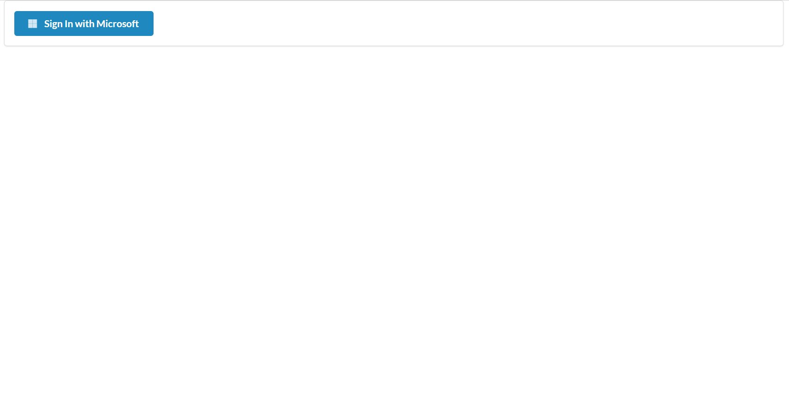
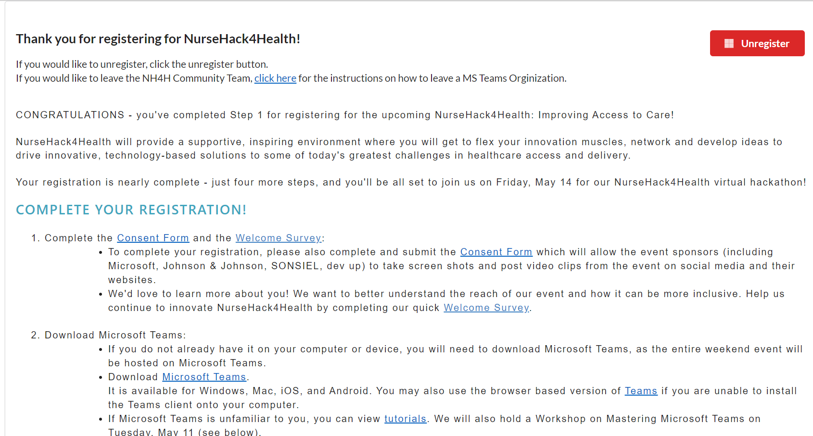
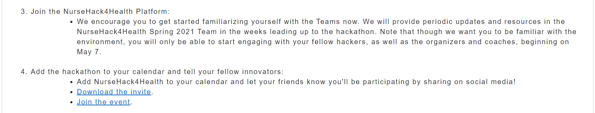
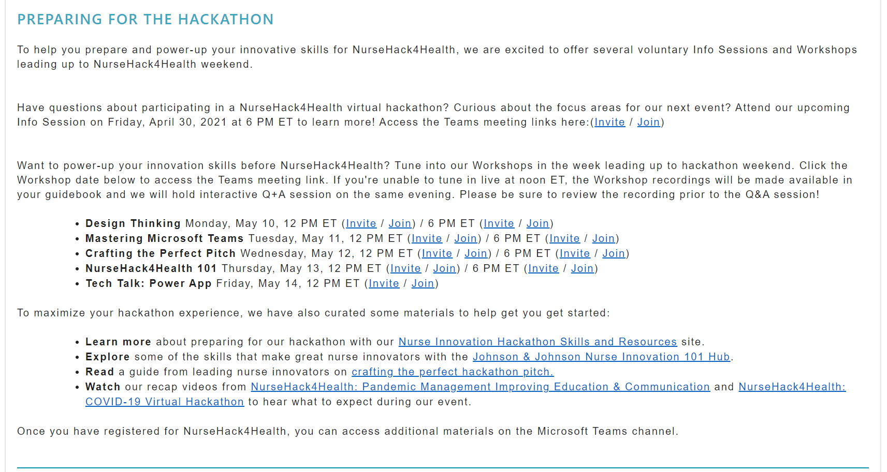
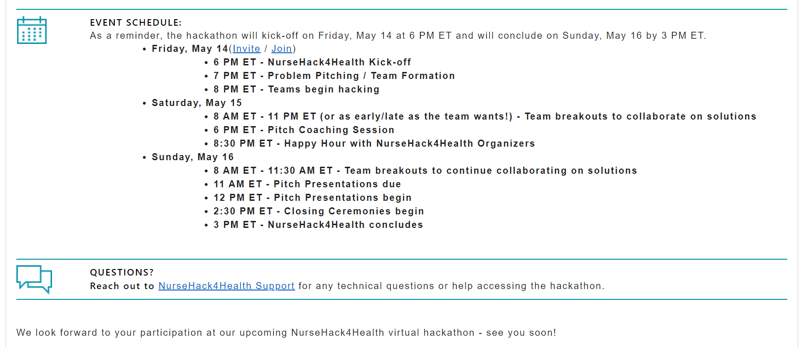

# Introduction 
TODO: Give a short introduction of your project. Let this section explain the objectives or the motivation behind this project. 

# Getting Started
TODO: Guide users through getting your code up and running on their own system. In this section you can talk about:
1.	Installation process
2.	Software dependencies
3.	Latest releases
4.	API references

# Build and Test 
**Why?**
The purpose of this application is to complete the registration process to be ready as a participant on the starting day of the hackathon. In doing so, additional information is given in preparation for the three day event.

The first step to register for NurseHack4Health is very simple. To begin, sign in with Microsoft. 

You now completed the first step to register for NurseHack4Health. You will be redirected to a page where you must complete four more steps to complete registration.

Congratulations! You are now registered for NurseHack4Health. Following the completion of these steps, you will be given information on Info Sessions and Workshops to help you prepare for the Hackathon.

Below you have the itinerary for NurseHack4Health. Additionally, you have a link for any questions you may have.

# Contribute
TODO: Explain how other users and developers can contribute to make your code better. 

If you want to learn more about creating good readme files then refer the following [guidelines](https://docs.microsoft.com/en-us/azure/devops/repos/git/create-a-readme?view=azure-devops). You can also seek inspiration from the below readme files:
- [ASP.NET Core](https://github.com/aspnet/Home)
- [Visual Studio Code](https://github.com/Microsoft/vscode)
- [Chakra Core](https://github.com/Microsoft/ChakraCore)
